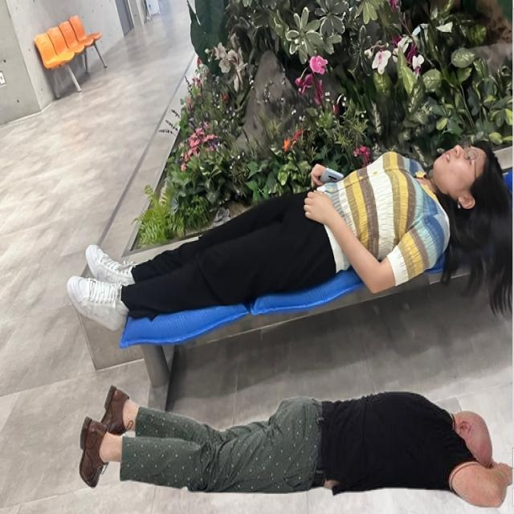

# 危险场景检测检测系统源码分享
 # [一条龙教学YOLOV8标注好的数据集一键训练_70+全套改进创新点发刊_Web前端展示]

### 1.研究背景与意义

项目参考[AAAI Association for the Advancement of Artificial Intelligence](https://gitee.com/qunshansj/projects)

项目来源[AACV Association for the Advancement of Computer Vision](https://gitee.com/qunmasj/projects)

研究背景与意义

随着城市化进程的加快和工业化水平的提高，危险场景的发生频率逐渐上升，给人们的生命财产安全带来了严重威胁。传统的危险场景监测手段往往依赖于人工巡查和简单的监控设备，存在反应慢、覆盖面窄等缺陷，难以实现实时、高效的危险预警。因此，基于深度学习的智能监测系统应运而生，成为提升安全管理水平的重要工具。

YOLO（You Only Look Once）系列模型以其高效的实时目标检测能力在计算机视觉领域取得了显著成就。YOLOv8作为该系列的最新版本，进一步提升了检测精度和速度，适用于复杂场景下的多目标检测。针对危险场景的检测需求，基于改进YOLOv8的危险场景检测系统不仅能够实现对多种危险行为的实时监测，还能通过数据分析为安全管理提供决策支持。

本研究将利用一个包含6600张图像的多类别数据集，涵盖24个类别的异常活动检测，包括烟雾检测、建筑损坏、人员状态等。这些类别的多样性使得模型在训练过程中能够学习到丰富的特征，从而提高对复杂危险场景的识别能力。例如，烟雾检测不仅可以用于火灾预警，还可以用于工业环境中的气体泄漏监测；而建筑损坏的检测则有助于及时发现安全隐患，避免潜在的事故发生。

在数据集的构建过程中，使用了roboflow等工具进行数据标注和处理，确保了数据的准确性和多样性。通过对不同类别的细致标注，模型能够更好地理解各种危险场景的特征，从而提升检测的准确率。此外，数据集中包含的多种场景和状态，如“硬帽佩戴状态”、“光源状态”等，也为模型提供了更为全面的训练基础，进一步增强了其实用性。

本研究的意义不仅在于技术层面的创新，更在于其对社会安全管理的深远影响。通过构建基于改进YOLOv8的危险场景检测系统，可以有效提高对危险行为的监测能力，及时预警潜在的安全隐患，进而减少事故发生的概率，保护人们的生命财产安全。同时，该系统的应用还可以为各类行业提供安全管理的智能化解决方案，推动安全管理向数字化、智能化转型。

综上所述，基于改进YOLOv8的危险场景检测系统的研究具有重要的理论价值和实际意义。它不仅为深度学习在安全监测领域的应用提供了新的思路，也为实现更高效的安全管理模式奠定了基础。通过不断优化和完善该系统，有望在未来的安全管理实践中发挥更大的作用，助力构建更加安全的社会环境。

### 2.图片演示


##### 注意：由于此博客编辑较早，上面“2.图片演示”和“3.视频演示”展示的系统图片或者视频可能为老版本，新版本在老版本的基础上升级如下：（实际效果以升级的新版本为准）

  （1）适配了YOLOV8的“目标检测”模型和“实例分割”模型，通过加载相应的权重（.pt）文件即可自适应加载模型。

  （2）支持“图片识别”、“视频识别”、“摄像头实时识别”三种识别模式。

  （3）支持“图片识别”、“视频识别”、“摄像头实时识别”三种识别结果保存导出，解决手动导出（容易卡顿出现爆内存）存在的问题，识别完自动保存结果并导出到tempDir中。

  （4）支持Web前端系统中的标题、背景图等自定义修改，后面提供修改教程。

  另外本项目提供训练的数据集和训练教程,暂不提供权重文件（best.pt）,需要您按照教程进行训练后实现图片演示和Web前端界面演示的效果。

### 3.视频演示

[3.1 视频演示](https://member.bilibili.com/platform/upload-manager/article)

### 4.数据集信息展示

##### 4.1 本项目数据集详细数据（类别数＆类别名）

nc: 4
names: ['Api Kebakaran', 'Smoke100 - v1 224x224 M', 'cutpaste_lay - v3 2024-06-13 4-59am', 'keretakan']


##### 4.2 本项目数据集信息介绍

数据集信息展示

在构建一个高效的危险场景检测系统时，数据集的选择和构建至关重要。本研究所采用的数据集名为“Abnormal Activities”，该数据集专门设计用于训练和改进YOLOv8模型，以提升其在危险场景检测中的表现。数据集包含四个主要类别，分别为“Api Kebakaran”（火焰）、“Smoke100 - v1 224x224 M”（烟雾）、“cutpaste_lay - v3 2024-06-13 4-59am”（剪切粘贴布局）和“keretakan”（裂缝）。这些类别的选择旨在涵盖各种潜在的危险活动，从而为模型提供丰富的训练样本，以便其能够在实际应用中准确识别和分类不同的危险场景。

首先，类别“Api Kebakaran”代表火焰的存在，火焰是许多危险场景的直接指示。通过对这一类别的图像进行标注和训练，YOLOv8模型能够学习到火焰的特征，如颜色、形状和动态变化。这一类别的图像通常包含不同环境下的火焰表现，例如室内火灾、森林火灾等，这些场景的多样性为模型提供了广泛的学习机会。

其次，“Smoke100 - v1 224x224 M”类别则专注于烟雾的检测。烟雾的出现往往是火灾或其他危险事件的前兆，因此准确识别烟雾对于及时响应和预防事故至关重要。该类别的数据集包含多种类型的烟雾图像，涵盖了不同的颜色、浓度和背景环境，确保模型能够在各种情况下有效识别烟雾。

接下来，“cutpaste_lay - v3 2024-06-13 4-59am”类别的引入则为数据集增添了一个独特的维度。该类别可能涉及到某种特定的场景或行为，诸如在特定环境中进行的危险操作或不当行为。这一类别的设计意在帮助模型理解在特定情况下可能导致危险的行为，从而提升其对异常活动的敏感性。

最后，“keretakan”类别关注的是裂缝的检测，裂缝通常是结构性问题的指示，可能导致建筑物或其他结构的倒塌。通过对裂缝图像的标注和训练，YOLOv8模型能够学习到裂缝的特征，如形状、大小和位置，从而在实际应用中有效识别潜在的危险结构。

总的来说，“Abnormal Activities”数据集的设计充分考虑了各种危险场景的多样性与复杂性，为YOLOv8模型的训练提供了坚实的基础。通过对这四个类别的深入学习，模型将能够在实际应用中快速、准确地识别和响应各种危险活动，进而提高公共安全和应急响应的效率。这一数据集不仅为模型的训练提供了丰富的样本，也为未来的研究和应用奠定了基础，推动了危险场景检测技术的发展。





### 5.全套项目环境部署视频教程（零基础手把手教学）

[5.1 环境部署教程链接（零基础手把手教学）](https://www.ixigua.com/7404473917358506534?logTag=c807d0cbc21c0ef59de5)


[5.2 安装Python虚拟环境创建和依赖库安装视频教程链接（零基础手把手教学）](https://www.ixigua.com/7404474678003106304?logTag=1f1041108cd1f708b01a)

### 6.手把手YOLOV8训练视频教程（零基础小白有手就能学会）

[6.1 手把手YOLOV8训练视频教程（零基础小白有手就能学会）](https://www.ixigua.com/7404477157818401292?logTag=d31a2dfd1983c9668658)

### 7.70+种全套YOLOV8创新点代码加载调参视频教程（一键加载写好的改进模型的配置文件）

[7.1 70+种全套YOLOV8创新点代码加载调参视频教程（一键加载写好的改进模型的配置文件）](https://www.ixigua.com/7404478314661806627?logTag=29066f8288e3f4eea3a4)

### 8.70+种全套YOLOV8创新点原理讲解（非科班也可以轻松写刊发刊，V10版本正在科研待更新）

由于篇幅限制，每个创新点的具体原理讲解就不一一展开，具体见下列网址中的创新点对应子项目的技术原理博客网址【Blog】：


[8.1 70+种全套YOLOV8创新点原理讲解链接](https://gitee.com/qunmasj/good)

### 9.系统功能展示（检测对象为举例，实际内容以本项目数据集为准）

图9.1.系统支持检测结果表格显示

  图9.2.系统支持置信度和IOU阈值手动调节

  图9.3.系统支持自定义加载权重文件best.pt(需要你通过步骤5中训练获得)

  图9.4.系统支持摄像头实时识别

  图9.5.系统支持图片识别

  图9.6.系统支持视频识别

  图9.7.系统支持识别结果文件自动保存

  图9.8.系统支持Excel导出检测结果数据


### 10.原始YOLOV8算法原理

原始YOLOv8算法原理

YOLO（You Only Look Once）系列算法自2015年首次提出以来，经历了多个版本的迭代，逐步成为目标检测领域的佼佼者。YOLOv8作为最新的版本，结合了前几代的优点，进一步提升了检测精度和推理速度，成为业界广泛应用的主流算法之一。YOLOv8的设计理念是通过一个统一的网络结构，快速且高效地完成目标检测任务，其核心原理体现在网络的整体架构、特征提取、特征融合及目标检测等多个方面。

YOLOv8的网络结构主要由四个部分组成：输入层、Backbone骨干网络、Neck颈部结构和Head头部结构。输入层负责对输入图像进行预处理，包括图像的缩放、归一化以及数据增强等操作。数据增强技术如马赛克（Mosaic）增强，可以有效提高模型的鲁棒性和泛化能力。通过对图像进行多样化处理，YOLOv8能够在训练过程中接触到更多样的场景，从而提升模型的性能。

在Backbone部分，YOLOv8采用了改进的C2f模块，替代了YOLOv5中的C3模块。C2f模块通过引入更多的分支和跨层连接，增强了梯度流动，使得特征提取过程更加高效。该模块的设计使得网络能够在保持轻量化的同时，提取出更丰富的特征信息。此外，YOLOv8还引入了空间金字塔池化（SPPF）结构，通过不同内核尺寸的池化操作，对特征图进行融合，进一步提升了特征的表达能力。

Neck部分采用了路径聚合网络（PAN）结构，这一设计使得YOLOv8在特征融合时能够更好地结合不同尺度的特征信息。通过特征金字塔和路径聚合的结合，YOLOv8能够有效地处理多尺度目标，提升对小目标和大目标的检测能力。这种特征融合策略使得模型在面对复杂场景时，能够保持较高的检测精度。

在Head部分，YOLOv8采用了解耦头结构，将分类和回归任务分开处理。传统的耦合头结构在处理复杂场景时可能导致信息混淆，而解耦头结构则能够独立优化分类和回归任务，从而加速模型的收敛速度并提高检测精度。此外，YOLOv8还采用了无锚框（Anchor-Free）检测头，减少了锚框预测的数量，简化了模型的设计，进而加快了非最大抑制（NMS）过程，提高了检测效率。

YOLOv8在损失计算方面也进行了创新，采用了Task Aligned Assigner策略，根据分类与回归的分数加权结果选择正样本。这一策略的引入，使得模型在训练过程中能够更有效地学习到目标的特征，提高了分类和回归的准确性。分类分支使用二元交叉熵损失（BCELoss），而回归分支则结合了分布焦点损失（DFLoss）和完全交并比损失（CIOULoss），进一步提升了边界框预测的精准性。

在模型设置方面，YOLOv8提供了多种配置选项，包括depth_factor、width_factor和ratio等参数。这些参数允许用户根据具体应用场景的需求，灵活调整模型的深度和宽度，从而在检测精度和推理速度之间找到最佳平衡。通过对这些参数的合理设置，YOLOv8能够适应不同的硬件环境和应用需求，展现出极高的灵活性和适应性。

总的来说，YOLOv8通过一系列创新的设计和优化，提升了目标检测的性能，成为了当前目标检测领域的一个重要里程碑。其在特征提取、特征融合和目标检测等方面的改进，使得YOLOv8不仅在检测精度上有了显著提升，同时也在推理速度和模型的易用性上达到了新的高度。这些优势使得YOLOv8在实际应用中表现出色，广泛应用于自动驾驶、安防监控、工业检测等多个领域，展现了其强大的实用价值和广阔的应用前景。随着YOLOv8的不断发展和优化，未来的目标检测技术将更加智能化和高效化，为各行各业带来更多的便利和可能性。


### 11.项目核心源码讲解（再也不用担心看不懂代码逻辑）

#### 11.1 70+种YOLOv8算法改进源码大全和调试加载训练教程（非必要）\ultralytics\utils\ops.py

以下是对给定代码的核心部分进行提炼和详细注释的结果。代码的主要功能是实现YOLOv8目标检测中的一些基础操作，包括时间性能分析、坐标转换、非极大值抑制等。

```python
import time
import torch
import numpy as np
import torchvision

class Profile:
    """
    YOLOv8性能分析类，用于测量代码块的执行时间。
    使用示例：
        with Profile() as dt:
            # 执行某些操作
        print(dt)  # 输出耗时
    """
    def __init__(self):
        self.t = 0.0  # 初始化时间
        self.cuda = torch.cuda.is_available()  # 检查CUDA是否可用

    def __enter__(self):
        """开始计时"""
        self.start = time.time()  # 记录开始时间
        return self

    def __exit__(self, type, value, traceback):
        """结束计时"""
        self.dt = time.time() - self.start  # 计算耗时
        self.t += self.dt  # 累加耗时

    def __str__(self):
        """返回可读的耗时字符串"""
        return f'Elapsed time is {self.t:.6f} s'

def non_max_suppression(prediction, conf_thres=0.25, iou_thres=0.45):
    """
    执行非极大值抑制（NMS），以过滤重叠的边界框。
    
    Args:
        prediction (torch.Tensor): 模型预测的边界框及其置信度。
        conf_thres (float): 置信度阈值，低于该值的框将被过滤。
        iou_thres (float): IoU阈值，重叠度低于该值的框将被过滤。

    Returns:
        List[torch.Tensor]: 每个图像的保留边界框列表。
    """
    # 检查置信度和IoU阈值
    assert 0 <= conf_thres <= 1, f'Invalid Confidence threshold {conf_thres}'
    assert 0 <= iou_thres <= 1, f'Invalid IoU {iou_thres}'

    device = prediction.device  # 获取设备信息
    bs = prediction.shape[0]  # 批大小
    nc = prediction.shape[1] - 4  # 类别数量
    nm = prediction.shape[1] - nc - 4  # 掩码数量

    prediction = prediction.transpose(-1, -2)  # 转置预测结果
    prediction[..., :4] = xywh2xyxy(prediction[..., :4])  # 将xywh格式转换为xyxy格式

    output = [torch.zeros((0, 6 + nm), device=prediction.device)] * bs  # 初始化输出
    for xi, x in enumerate(prediction):  # 遍历每个图像的预测结果
        x = x[x[:, 4] > conf_thres]  # 过滤低置信度框

        if not x.shape[0]:  # 如果没有框，跳过
            continue

        # Detections matrix nx6 (xyxy, conf, cls)
        box, cls = x[:, :4], x[:, 4]  # 分离边界框和置信度
        conf, j = cls.max(1, keepdim=True)  # 获取最大置信度和对应类别
        x = torch.cat((box, conf, j.float()), 1)[conf.view(-1) > conf_thres]  # 组合信息并过滤

        # 执行NMS
        boxes, scores = x[:, :4], x[:, 4]  # 获取边界框和置信度
        i = torchvision.ops.nms(boxes, scores, iou_thres)  # 应用NMS
        output[xi] = x[i]  # 保存结果

    return output

def xywh2xyxy(x):
    """
    将边界框坐标从(x, y, width, height)格式转换为(x1, y1, x2, y2)格式。
    
    Args:
        x (torch.Tensor): 输入的边界框坐标。

    Returns:
        y (torch.Tensor): 转换后的边界框坐标。
    """
    assert x.shape[-1] == 4, f'input shape last dimension expected 4 but input shape is {x.shape}'
    y = torch.empty_like(x)  # 创建相同形状的空张量
    dw = x[..., 2] / 2  # 计算宽度的一半
    dh = x[..., 3] / 2  # 计算高度的一半
    y[..., 0] = x[..., 0] - dw  # 左上角x
    y[..., 1] = x[..., 1] - dh  # 左上角y
    y[..., 2] = x[..., 0] + dw  # 右下角x
    y[..., 3] = x[..., 1] + dh  # 右下角y
    return y
```

### 核心功能说明：
1. **Profile类**：用于测量代码块的执行时间，便于性能分析。
2. **non_max_suppression函数**：实现非极大值抑制算法，过滤掉重叠的边界框，以保留最有可能的检测结果。
3. **xywh2xyxy函数**：将边界框的坐标格式从中心点和宽高转换为左上角和右下角的坐标格式，便于后续处理。

这些功能是YOLOv8目标检测模型中的基础操作，其他的函数如坐标转换、框的裁剪等在实际应用中也会用到，但在此处我们仅保留了最核心的部分。

这个文件是Ultralytics YOLOv8算法的一部分，主要包含了一些实用的操作和工具函数，涉及到目标检测中的坐标转换、非极大值抑制、图像和掩码处理等功能。以下是对文件中各个部分的逐步分析。

首先，文件中定义了一个`Profile`类，用于性能分析。这个类可以作为装饰器或上下文管理器使用，帮助用户测量代码块的执行时间。它通过记录开始和结束时间来计算耗时，并提供一个友好的字符串表示。

接下来，`segment2box`函数将一个分割标签转换为一个边界框标签，确保边界框在图像内部。该函数接受一个分割标签和图像的宽高，返回一个包含最小和最大x、y值的数组。

`scale_boxes`函数用于根据不同图像的尺寸重新缩放边界框。它会计算缩放比例和填充，并根据这些信息调整边界框的坐标，确保它们适应新的图像尺寸。

`make_divisible`函数用于返回一个最接近的可被指定除数整除的数字，这在网络结构设计中非常有用。

`non_max_suppression`函数实现了非极大值抑制（NMS），用于从多个候选框中筛选出最优的框。它支持多标签和掩码，并允许用户设置置信度阈值和IoU阈值，以过滤掉低置信度的框和重叠过大的框。

`clip_boxes`和`clip_coords`函数用于将边界框和坐标限制在图像边界内，确保不会出现超出图像范围的情况。

`scale_image`函数用于将掩码调整为原始图像的大小，确保掩码与目标图像的尺寸一致。

`xyxy2xywh`和`xywh2xyxy`函数用于在不同的边界框表示格式之间进行转换，前者将(x1, y1, x2, y2)格式转换为(x, y, width, height)格式，后者则反之。

`xywhn2xyxy`和`xyxy2xywhn`函数则是用于将归一化的边界框坐标转换为像素坐标，反之亦然。

`segments2boxes`函数将分割标签转换为边界框标签，`resample_segments`函数则对给定的分割进行重采样，以生成固定数量的点。

`crop_mask`函数根据给定的边界框裁剪掩码，`process_mask`系列函数则处理掩码的上采样和应用，确保掩码与边界框匹配。

`masks2segments`函数将掩码转换为分割，提供了不同的策略（如选择最大分割或连接所有分割）。

最后，`convert_torch2numpy_batch`函数用于将PyTorch张量批量转换为NumPy数组，并调整维度，`clean_str`函数则用于清理字符串，替换特殊字符为下划线。

整体而言，这个文件提供了YOLOv8模型中常用的操作和工具函数，帮助用户在目标检测任务中进行数据处理、坐标转换和性能分析等工作。

#### 11.2 70+种YOLOv8算法改进源码大全和调试加载训练教程（非必要）\ultralytics\utils\callbacks\mlflow.py

以下是经过简化和注释的核心代码部分：

```python
# 导入必要的库和模块
from ultralytics.utils import LOGGER, RUNS_DIR, SETTINGS, TESTS_RUNNING, colorstr

try:
    import os
    import mlflow  # 导入MLflow库

    # 确保在非测试环境下运行，并且MLflow集成已启用
    assert not TESTS_RUNNING or 'test_mlflow' in os.environ.get('PYTEST_CURRENT_TEST', '')
    assert SETTINGS['mlflow'] is True  # 验证集成是否启用

    # 确保mlflow模块被正确导入
    assert hasattr(mlflow, '__version__')  
    from pathlib import Path
    PREFIX = colorstr('MLflow: ')  # 设置日志前缀

except (ImportError, AssertionError):
    mlflow = None  # 如果导入失败，则将mlflow设置为None


def on_pretrain_routine_end(trainer):
    """
    在预训练结束时记录训练参数到MLflow。

    参数:
        trainer (ultralytics.engine.trainer.BaseTrainer): 包含要记录的参数的训练对象。

    全局变量:
        mlflow: 用于记录的mlflow模块。

    环境变量:
        MLFLOW_TRACKING_URI: MLflow跟踪的URI，默认为'runs/mlflow'。
        MLFLOW_EXPERIMENT_NAME: MLflow实验的名称，默认为trainer.args.project。
        MLFLOW_RUN: MLflow运行的名称，默认为trainer.args.name。
    """
    global mlflow

    # 获取跟踪URI
    uri = os.environ.get('MLFLOW_TRACKING_URI') or str(RUNS_DIR / 'mlflow')
    LOGGER.debug(f'{PREFIX} tracking uri: {uri}')
    mlflow.set_tracking_uri(uri)  # 设置MLflow跟踪URI

    # 设置实验和运行名称
    experiment_name = os.environ.get('MLFLOW_EXPERIMENT_NAME') or trainer.args.project or '/Shared/YOLOv8'
    run_name = os.environ.get('MLFLOW_RUN') or trainer.args.name
    mlflow.set_experiment(experiment_name)  # 设置实验名称

    mlflow.autolog()  # 启用自动记录
    try:
        # 开始一个新的运行或获取当前活动的运行
        active_run = mlflow.active_run() or mlflow.start_run(run_name=run_name)
        LOGGER.info(f'{PREFIX}logging run_id({active_run.info.run_id}) to {uri}')
        
        # 提供访问MLflow服务器的链接
        if Path(uri).is_dir():
            LOGGER.info(f"{PREFIX}view at http://127.0.0.1:5000 with 'mlflow server --backend-store-uri {uri}'")
        
        # 记录训练参数
        mlflow.log_params(dict(trainer.args))
    except Exception as e:
        LOGGER.warning(f'{PREFIX}WARNING ⚠️ Failed to initialize: {e}\n'
                       f'{PREFIX}WARNING ⚠️ Not tracking this run')


def on_fit_epoch_end(trainer):
    """在每个训练周期结束时记录训练指标到MLflow。"""
    if mlflow:
        # 清理指标名称并记录到MLflow
        sanitized_metrics = {k.replace('(', '').replace(')', ''): float(v) for k, v in trainer.metrics.items()}
        mlflow.log_metrics(metrics=sanitized_metrics, step=trainer.epoch)


def on_train_end(trainer):
    """在训练结束时记录模型工件。"""
    if mlflow:
        # 记录最佳模型的目录
        mlflow.log_artifact(str(trainer.best.parent))  
        
        # 记录保存目录中的所有文件
        for f in trainer.save_dir.glob('*'):
            if f.suffix in {'.png', '.jpg', '.csv', '.pt', '.yaml'}:
                mlflow.log_artifact(str(f))

        mlflow.end_run()  # 结束当前运行
        LOGGER.info(f'{PREFIX}results logged to {mlflow.get_tracking_uri()}\n'
                    f"{PREFIX}disable with 'yolo settings mlflow=False'")


# 定义回调函数字典
callbacks = {
    'on_pretrain_routine_end': on_pretrain_routine_end,
    'on_fit_epoch_end': on_fit_epoch_end,
    'on_train_end': on_train_end} if mlflow else {}
```

### 代码说明：
1. **导入模块**：导入必要的库，包括`os`和`mlflow`，并进行一些基本的检查以确保环境的正确性。
2. **on_pretrain_routine_end**：在预训练结束时调用，设置MLflow的跟踪URI、实验名称和运行名称，并记录训练参数。
3. **on_fit_epoch_end**：在每个训练周期结束时调用，记录当前的训练指标。
4. **on_train_end**：在训练结束时调用，记录模型的工件（如最佳模型和其他文件）。
5. **callbacks字典**：根据是否成功导入`mlflow`，定义相应的回调函数。

这个程序文件是用于Ultralytics YOLO模型的MLflow日志记录模块。MLflow是一个开源平台，用于管理机器学习项目的生命周期，包括实验跟踪、模型管理和部署等功能。该模块的主要功能是记录训练过程中的参数、指标和模型工件。

文件开头包含了一些注释，介绍了该模块的用途和基本命令。用户可以通过设置环境变量来配置MLflow的项目名称、运行名称以及启动本地MLflow服务器的命令。文件中提供了如何设置这些环境变量的示例，并说明了如何终止正在运行的MLflow服务器实例。

接下来，程序尝试导入必要的库，包括`os`和`mlflow`，并进行了一些断言检查，以确保在适当的环境中运行。特别是，它检查是否在测试环境中运行（如pytest），并确认MLflow集成是否已启用。如果导入失败或断言失败，`mlflow`将被设置为`None`，以避免后续代码中的错误。

在定义的几个函数中，`on_pretrain_routine_end`函数用于在预训练例程结束时记录训练参数。它根据环境变量和训练器的参数设置MLflow的跟踪URI、实验名称和运行名称，并启动MLflow运行。然后，它记录训练器的参数。

`on_fit_epoch_end`函数在每个训练周期结束时记录训练指标。它会清理指标名称并将其记录到MLflow中。

`on_train_end`函数在训练结束时记录模型工件，包括最佳模型和其他相关文件。它会将保存目录中的文件记录到MLflow，并结束当前的MLflow运行。

最后，程序将这些回调函数组织成一个字典，只有在成功导入`mlflow`的情况下才会定义该字典。这个字典可以在训练过程中被调用，以实现自动记录训练过程中的重要信息。

总体来说，这个模块为YOLO模型的训练过程提供了强大的日志记录功能，方便用户跟踪和管理实验结果。

#### 11.3 ui.py

```python
import sys
import subprocess

def run_script(script_path):
    """
    使用当前 Python 环境运行指定的脚本。

    Args:
        script_path (str): 要运行的脚本路径

    Returns:
        None
    """
    # 获取当前 Python 解释器的路径
    python_path = sys.executable

    # 构建运行命令，使用 streamlit 运行指定的脚本
    command = f'"{python_path}" -m streamlit run "{script_path}"'

    # 执行命令
    result = subprocess.run(command, shell=True)
    # 检查命令执行结果，如果返回码不为0，表示执行出错
    if result.returncode != 0:
        print("脚本运行出错。")


# 主程序入口
if __name__ == "__main__":
    # 指定要运行的脚本路径
    script_path = "web.py"  # 假设脚本在当前目录下

    # 调用函数运行脚本
    run_script(script_path)
```

### 代码核心部分及注释说明：

1. **导入模块**：
   - `sys`：用于访问与 Python 解释器紧密相关的变量和函数。
   - `subprocess`：用于创建新进程、连接到它们的输入/输出/错误管道，并获取返回码。

2. **`run_script` 函数**：
   - 该函数接收一个脚本路径作为参数，并在当前 Python 环境中运行该脚本。
   - 使用 `sys.executable` 获取当前 Python 解释器的路径，以确保使用正确的 Python 环境。
   - 构建一个命令字符串，使用 `streamlit` 模块运行指定的脚本。
   - 使用 `subprocess.run` 执行构建的命令，并检查返回码以确定脚本是否成功运行。

3. **主程序入口**：
   - 通过 `if __name__ == "__main__":` 确保只有在直接运行该脚本时才会执行以下代码。
   - 指定要运行的脚本路径（在这里假设为 "web.py"）。
   - 调用 `run_script` 函数来执行指定的脚本。

这个程序文件名为 `ui.py`，主要功能是使用当前的 Python 环境来运行一个指定的脚本。文件中首先导入了必要的模块，包括 `sys`、`os` 和 `subprocess`，以及一个自定义的模块 `QtFusion.path` 中的 `abs_path` 函数。

在 `run_script` 函数中，程序接受一个参数 `script_path`，这个参数是要运行的脚本的路径。函数内部首先获取当前 Python 解释器的路径，使用 `sys.executable` 来实现。接着，构建一个命令字符串，该命令使用 `streamlit` 来运行指定的脚本。具体来说，命令格式为 `"{python_path}" -m streamlit run "{script_path}"`，其中 `python_path` 是当前 Python 解释器的路径，`script_path` 是传入的脚本路径。

随后，程序使用 `subprocess.run` 方法来执行这个命令，`shell=True` 参数表示在 shell 中执行命令。执行完命令后，程序检查返回的结果码，如果结果码不为 0，表示脚本运行出错，此时会打印出一条错误信息。

在文件的最后部分，使用 `if __name__ == "__main__":` 语句来确保只有在直接运行该文件时才会执行下面的代码。这里指定了要运行的脚本路径为 `web.py`，并调用 `abs_path` 函数来获取该路径的绝对路径。最后，调用 `run_script` 函数来执行这个脚本。

总体来说，这个程序的作用是为用户提供一个简单的接口，以便在当前 Python 环境中运行一个 Streamlit 应用脚本。

#### 11.4 70+种YOLOv8算法改进源码大全和调试加载训练教程（非必要）\ultralytics\models\fastsam\utils.py

以下是经过简化和注释的核心代码部分：

```python
import torch

def adjust_bboxes_to_image_border(boxes, image_shape, threshold=20):
    """
    调整边界框，使其在接近图像边缘时贴合图像边界。

    参数:
        boxes (torch.Tensor): 边界框坐标，形状为 (n, 4)
        image_shape (tuple): 图像的高度和宽度，形状为 (height, width)
        threshold (int): 像素阈值，表示边界框与图像边缘的最小距离

    返回:
        adjusted_boxes (torch.Tensor): 调整后的边界框
    """
    h, w = image_shape  # 获取图像的高度和宽度

    # 调整边界框的坐标
    boxes[boxes[:, 0] < threshold, 0] = 0  # 如果左边界小于阈值，则设置为0
    boxes[boxes[:, 1] < threshold, 1] = 0  # 如果上边界小于阈值，则设置为0
    boxes[boxes[:, 2] > w - threshold, 2] = w  # 如果右边界大于图像宽度减去阈值，则设置为图像宽度
    boxes[boxes[:, 3] > h - threshold, 3] = h  # 如果下边界大于图像高度减去阈值，则设置为图像高度
    return boxes  # 返回调整后的边界框

def bbox_iou(box1, boxes, iou_thres=0.9, image_shape=(640, 640), raw_output=False):
    """
    计算一个边界框与其他边界框的交并比 (IoU)。

    参数:
        box1 (torch.Tensor): 单个边界框，形状为 (4, )
        boxes (torch.Tensor): 一组边界框，形状为 (n, 4)
        iou_thres (float): IoU 阈值
        image_shape (tuple): 图像的高度和宽度，形状为 (height, width)
        raw_output (bool): 如果为 True，则返回原始 IoU 值，而不是索引

    返回:
        high_iou_indices (torch.Tensor): IoU 大于阈值的边界框索引
    """
    boxes = adjust_bboxes_to_image_border(boxes, image_shape)  # 调整边界框以贴合图像边界

    # 计算交集的坐标
    x1 = torch.max(box1[0], boxes[:, 0])  # 交集左上角 x 坐标
    y1 = torch.max(box1[1], boxes[:, 1])  # 交集左上角 y 坐标
    x2 = torch.min(box1[2], boxes[:, 2])  # 交集右下角 x 坐标
    y2 = torch.min(box1[3], boxes[:, 3])  # 交集右下角 y 坐标

    # 计算交集的面积
    intersection = (x2 - x1).clamp(0) * (y2 - y1).clamp(0)  # 使用 clamp 确保面积不为负

    # 计算两个边界框的面积
    box1_area = (box1[2] - box1[0]) * (box1[3] - box1[1])  # box1 的面积
    box2_area = (boxes[:, 2] - boxes[:, 0]) * (boxes[:, 3] - boxes[:, 1])  # boxes 的面积

    # 计算并集的面积
    union = box1_area + box2_area - intersection  # 并集面积 = A + B - 交集

    # 计算 IoU
    iou = intersection / union  # 计算 IoU 值
    if raw_output:
        return 0 if iou.numel() == 0 else iou  # 如果需要原始 IoU 值，直接返回

    # 返回 IoU 大于阈值的边界框索引
    return torch.nonzero(iou > iou_thres).flatten()
```

### 代码说明：
1. **adjust_bboxes_to_image_border** 函数用于调整边界框的位置，使其在接近图像边缘时不超出图像边界。它接受边界框的坐标、图像的尺寸和一个阈值作为输入，返回调整后的边界框。

2. **bbox_iou** 函数计算一个边界框与一组其他边界框之间的交并比 (IoU)。它首先调用 `adjust_bboxes_to_image_border` 函数来确保所有边界框都在图像边界内，然后计算交集和并集的面积，最后返回 IoU 大于指定阈值的边界框的索引。

这个程序文件是用于YOLO（You Only Look Once）算法的一部分，主要涉及边界框（bounding boxes）的调整和计算交并比（IoU, Intersection over Union）的功能。文件中包含两个主要的函数：`adjust_bboxes_to_image_border`和`bbox_iou`。

首先，`adjust_bboxes_to_image_border`函数的作用是将给定的边界框调整到图像的边界内，确保它们不会超出图像的范围。函数接收三个参数：`boxes`是一个包含多个边界框的张量，每个边界框由四个坐标（x1, y1, x2, y2）表示；`image_shape`是一个元组，包含图像的高度和宽度；`threshold`是一个阈值，表示边界框距离图像边界的最小距离。如果边界框的某个边距图像边界的距离小于这个阈值，则该边界框会被调整到图像的边界上。函数返回调整后的边界框。

接下来，`bbox_iou`函数用于计算一个边界框与一组其他边界框之间的交并比。该函数接收多个参数，包括要计算的边界框`box1`、其他边界框`boxes`、IoU阈值`iou_thres`、图像的形状`image_shape`以及一个布尔值`raw_output`，指示是否返回原始的IoU值。函数首先调用`adjust_bboxes_to_image_border`来确保所有边界框都在图像边界内。然后，计算`box1`与`boxes`之间的交集区域，接着计算各个边界框的面积，并最终计算它们的交并比。函数返回与`box1`的IoU大于指定阈值的边界框的索引，或者如果`raw_output`为真，则返回原始的IoU值。

整体来看，这段代码实现了对边界框的处理和IoU计算，能够帮助在目标检测任务中评估检测结果的准确性。

#### 11.5 train.py

以下是代码中最核心的部分，并附上详细的中文注释：

```python
class DetectionTrainer(BaseTrainer):
    """
    DetectionTrainer类，继承自BaseTrainer类，用于基于检测模型的训练。
    """

    def build_dataset(self, img_path, mode="train", batch=None):
        """
        构建YOLO数据集。

        参数:
            img_path (str): 包含图像的文件夹路径。
            mode (str): 模式，可以是'train'或'val'，用户可以为每种模式自定义不同的数据增强。
            batch (int, optional): 批次大小，仅用于'rect'模式。默认为None。
        """
        gs = max(int(de_parallel(self.model).stride.max() if self.model else 0), 32)
        return build_yolo_dataset(self.args, img_path, batch, self.data, mode=mode, rect=mode == "val", stride=gs)

    def get_dataloader(self, dataset_path, batch_size=16, rank=0, mode="train"):
        """构造并返回数据加载器。"""
        assert mode in ["train", "val"]  # 确保模式是'train'或'val'
        with torch_distributed_zero_first(rank):  # 仅在DDP中初始化数据集*.cache一次
            dataset = self.build_dataset(dataset_path, mode, batch_size)
        shuffle = mode == "train"  # 训练模式下打乱数据
        if getattr(dataset, "rect", False) and shuffle:
            LOGGER.warning("WARNING ⚠️ 'rect=True'与DataLoader的shuffle不兼容，设置shuffle=False")
            shuffle = False
        workers = self.args.workers if mode == "train" else self.args.workers * 2  # 根据模式设置工作线程数
        return build_dataloader(dataset, batch_size, workers, shuffle, rank)  # 返回数据加载器

    def preprocess_batch(self, batch):
        """对一批图像进行预处理，包括缩放和转换为浮点数。"""
        batch["img"] = batch["img"].to(self.device, non_blocking=True).float() / 255  # 将图像转移到设备并归一化
        if self.args.multi_scale:  # 如果启用多尺度
            imgs = batch["img"]
            sz = (
                random.randrange(self.args.imgsz * 0.5, self.args.imgsz * 1.5 + self.stride)
                // self.stride
                * self.stride
            )  # 随机选择图像大小
            sf = sz / max(imgs.shape[2:])  # 计算缩放因子
            if sf != 1:
                ns = [
                    math.ceil(x * sf / self.stride) * self.stride for x in imgs.shape[2:]
                ]  # 计算新的形状
                imgs = nn.functional.interpolate(imgs, size=ns, mode="bilinear", align_corners=False)  # 进行插值缩放
            batch["img"] = imgs  # 更新批次中的图像
        return batch

    def get_model(self, cfg=None, weights=None, verbose=True):
        """返回YOLO检测模型。"""
        model = DetectionModel(cfg, nc=self.data["nc"], verbose=verbose and RANK == -1)  # 创建检测模型
        if weights:
            model.load(weights)  # 加载权重
        return model

    def get_validator(self):
        """返回用于YOLO模型验证的DetectionValidator。"""
        self.loss_names = "box_loss", "cls_loss", "dfl_loss"  # 定义损失名称
        return yolo.detect.DetectionValidator(
            self.test_loader, save_dir=self.save_dir, args=copy(self.args), _callbacks=self.callbacks
        )  # 返回验证器

    def plot_training_samples(self, batch, ni):
        """绘制带有注释的训练样本。"""
        plot_images(
            images=batch["img"],
            batch_idx=batch["batch_idx"],
            cls=batch["cls"].squeeze(-1),
            bboxes=batch["bboxes"],
            paths=batch["im_file"],
            fname=self.save_dir / f"train_batch{ni}.jpg",
            on_plot=self.on_plot,
        )  # 绘制图像并保存

    def plot_metrics(self):
        """从CSV文件中绘制指标。"""
        plot_results(file=self.csv, on_plot=self.on_plot)  # 保存结果图像
```

### 代码核心部分说明：
1. **DetectionTrainer类**：这是一个用于训练YOLO检测模型的类，继承自基础训练类`BaseTrainer`。
2. **build_dataset方法**：用于构建YOLO数据集，支持训练和验证模式，并允许用户自定义数据增强。
3. **get_dataloader方法**：构造数据加载器，支持多进程加载和数据打乱。
4. **preprocess_batch方法**：对输入图像进行预处理，包括归一化和可选的多尺度调整。
5. **get_model方法**：创建并返回YOLO检测模型，可以加载预训练权重。
6. **get_validator方法**：返回用于模型验证的验证器，定义了损失名称。
7. **plot_training_samples和plot_metrics方法**：用于可视化训练样本和训练指标，帮助用户理解模型训练过程。

这个程序文件 `train.py` 是一个用于训练 YOLO（You Only Look Once）目标检测模型的脚本，继承自 `BaseTrainer` 类。程序中包含了多个方法，主要用于构建数据集、获取数据加载器、预处理图像、设置模型属性、获取模型、验证模型、记录损失、显示训练进度、绘制训练样本和绘制训练指标等。

首先，`DetectionTrainer` 类通过 `build_dataset` 方法构建 YOLO 数据集。该方法接受图像路径、模式（训练或验证）和批次大小作为参数，并根据模型的步幅（stride）设置合适的图像大小。接着，`get_dataloader` 方法用于构建数据加载器，确保在分布式训练时只初始化一次数据集，并根据模式设置是否打乱数据。

在数据预处理方面，`preprocess_batch` 方法将图像转换为浮点数并进行缩放处理。如果启用了多尺度训练，图像会根据随机生成的尺寸进行插值调整，以适应模型的输入要求。

`set_model_attributes` 方法用于设置模型的属性，包括类别数量和类别名称等，确保模型能够正确处理数据集中的目标。

获取模型的过程在 `get_model` 方法中实现，该方法返回一个 YOLO 检测模型，并可选择加载预训练权重。`get_validator` 方法则返回一个用于验证模型性能的验证器。

在训练过程中，`label_loss_items` 方法用于记录和返回训练损失项的字典，方便后续的分析和监控。`progress_string` 方法则格式化输出训练进度信息，包括当前的轮次、GPU 内存使用情况和损失值等。

此外，程序还提供了 `plot_training_samples` 方法，用于绘制带有注释的训练样本图像，帮助可视化训练过程中的数据。最后，`plot_metrics` 和 `plot_training_labels` 方法用于绘制训练指标和标签，便于分析模型的训练效果。

整体来看，这个程序文件是一个功能全面的 YOLO 模型训练工具，能够处理数据集构建、模型训练、验证和结果可视化等多个方面。

#### 11.6 code\ultralytics\utils\callbacks\raytune.py

以下是代码中最核心的部分，并附上详细的中文注释：

```python
# 导入必要的库和模块
from ultralytics.utils import SETTINGS

# 尝试导入Ray库并验证Ray Tune集成是否启用
try:
    assert SETTINGS["raytune"] is True  # 验证Ray Tune集成是否启用
    import ray
    from ray import tune
    from ray.air import session
except (ImportError, AssertionError):
    tune = None  # 如果导入失败或集成未启用，则将tune设置为None

def on_fit_epoch_end(trainer):
    """在每个训练周期结束时，将训练指标发送到Ray Tune。"""
    if ray.tune.is_session_enabled():  # 检查Ray Tune会话是否启用
        metrics = trainer.metrics  # 获取当前训练指标
        metrics["epoch"] = trainer.epoch  # 将当前周期数添加到指标中
        session.report(metrics)  # 向Ray Tune报告当前指标

# 定义回调函数，如果tune可用，则注册on_fit_epoch_end回调
callbacks = (
    {
        "on_fit_epoch_end": on_fit_epoch_end,  # 注册周期结束时的回调函数
    }
    if tune  # 如果tune可用
    else {}
)
```

### 代码说明：
1. **导入模块**：首先导入了`SETTINGS`，用于检查Ray Tune的集成状态。
2. **集成验证**：通过`try`语句块，检查`SETTINGS`中是否启用了Ray Tune。如果没有启用或导入失败，则将`tune`设置为`None`。
3. **回调函数**：定义了`on_fit_epoch_end`函数，该函数在每个训练周期结束时被调用，用于将训练的指标报告给Ray Tune。
4. **回调注册**：根据`tune`的可用性，决定是否注册`on_fit_epoch_end`作为回调函数。

这个程序文件是一个用于与Ray Tune集成的回调函数，主要用于在训练过程中收集和报告训练指标。首先，文件导入了`SETTINGS`，这是一个配置字典，用于检查Ray Tune集成是否启用。接着，程序尝试导入Ray及其相关模块，如果导入失败或集成未启用，则将`tune`设置为`None`。

文件中定义了一个名为`on_fit_epoch_end`的函数，该函数在每个训练周期结束时被调用。函数内部首先检查Ray Tune的会话是否已启用，如果启用，则从训练器（trainer）中获取当前的训练指标，并将当前的周期数添加到指标中。然后，使用`session.report(metrics)`将这些指标报告给Ray Tune，以便进行进一步的分析和可视化。

最后，文件定义了一个名为`callbacks`的元组，如果`tune`模块可用，则包含`on_fit_epoch_end`回调函数；如果不可用，则为空字典。这种设计使得代码在不同的环境中具有灵活性，可以根据Ray Tune的可用性动态调整回调函数的设置。整体来看，这段代码的目的是为了在使用Ultralytics YOLO进行训练时，能够方便地将训练过程中的重要指标传递给Ray Tune进行监控和优化。

### 12.系统整体结构（节选）

### 整体功能和构架概括

该项目是一个基于YOLOv8算法的目标检测框架，包含多个模块和工具，旨在提供高效的训练、验证和推理功能。整体架构包括数据处理、模型训练、性能监控和可视化等多个方面。项目的核心功能围绕YOLOv8模型的训练和优化展开，提供了灵活的回调机制，以便与外部工具（如MLflow和Ray Tune）集成，从而实现实验的跟踪和超参数优化。

### 文件功能整理表

| 文件路径                                                                                          | 功能描述                                                                                               |
|---------------------------------------------------------------------------------------------------|--------------------------------------------------------------------------------------------------------|
| `ultralytics/utils/ops.py`                                                                        | 提供了边界框处理、坐标转换、非极大值抑制等实用工具函数，支持目标检测中的数据处理和性能分析。                     |
| `ultralytics/utils/callbacks/mlflow.py`                                                          | 实现了与MLflow集成的回调函数，用于记录训练过程中的参数、指标和模型工件，便于实验跟踪和管理。                  |
| `ui.py`                                                                                           | 提供了一个简单的接口，用于在当前Python环境中运行指定的Streamlit应用脚本。                                   |
| `ultralytics/models/fastsam/utils.py`                                                             | 包含边界框调整和交并比计算的功能，支持目标检测中的边界框处理和性能评估。                                   |
| `train.py`                                                                                        | 负责YOLO模型的训练过程，包括数据集构建、模型训练、验证和结果可视化等功能。                                   |
| `ultralytics/utils/callbacks/raytune.py`                                                         | 提供了与Ray Tune集成的回调函数，用于在训练过程中收集和报告训练指标，便于超参数优化。                        |
| `ultralytics/models/sam/modules/sam.py`                                                          | 可能包含与SAM（Segment Anything Model）相关的模块和功能，具体功能需根据代码内容进一步分析。                |
| `ultralytics/nn/modules/__init__.py`                                                             | 初始化神经网络模块，可能包含不同网络层和模型的定义。                                                    |
| `ultralytics/hub/utils.py`                                                                        | 提供与模型仓库相关的工具函数，可能用于模型的加载和管理。                                                |
| `ultralytics/nn/extra_modules/head.py`                                                           | 定义YOLO模型的头部结构，负责输出预测结果的层。                                                          |
| `ultralytics/utils/plotting.py`                                                                   | 提供可视化功能，用于绘制训练过程中的指标和样本，帮助分析模型性能。                                        |
| `ultralytics/nn/extra_modules/rep_block.py`                                                      | 可能定义了某种特定的残差块结构，用于构建更深的神经网络，具体功能需根据代码内容进一步分析。                  |

以上表格总结了每个文件的主要功能，帮助理解整个项目的结构和各个模块之间的关系。整体而言，该项目为YOLOv8算法的实现和应用提供了全面的支持，涵盖了从数据处理到模型训练和结果可视化的各个方面。

注意：由于此博客编辑较早，上面“11.项目核心源码讲解（再也不用担心看不懂代码逻辑）”中部分代码可能会优化升级，仅供参考学习，完整“训练源码”、“Web前端界面”和“70+种创新点源码”以“13.完整训练+Web前端界面+70+种创新点源码、数据集获取”的内容为准。

### 13.完整训练+Web前端界面+70+种创新点源码、数据集获取


# [下载链接：https://mbd.pub/o/bread/ZpuTl5du](https://mbd.pub/o/bread/ZpuTl5du)